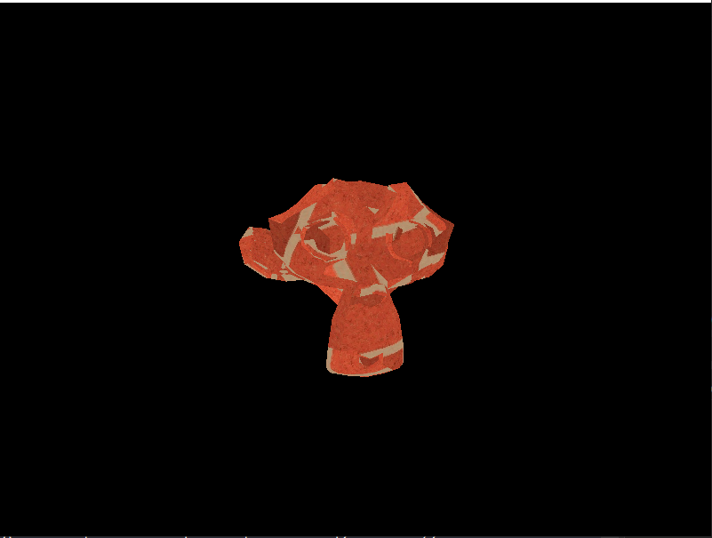

# QRasterizer
A rasterizer for me to understand how a rendering API (OpenGL, DirectX) roughly works under the hood.

<table><tr>
<td>  </td>
<td>  </td>
<td>  </td>
</tr></table>

---

## Configuration
- Run `git clone --recurse-submodules https://github.com/HarryNguyen1998/QRasterizer.git`
- From project root folder: `mkdir Game && cmake -S Src -B Game -G "Ninja" && cmake --build Game`
- Go to Game folder, then run QRasterizer.exe

Q: How to build in VS2017:
- Run `git clone --recursive-submodules https://github.com/HarryNguyen1998/QRasterizer.git`
- Open the project folder in VS2017 and let it parse.
- Click the drop-down arrow in Configuration > Manage Configurations to create a CMakeSettings.json file
- CMAKE tab > Build Only QRasterizer target. Then, Select Startup Item to QRasterizer.exe, then
  click on it to see the project running.

Controls:
- W/S/A/D to move the camera up/down/left/right.
- leftarrow/rightarrow to rotate the camera around the y-axis.

---

## Development notes
Features:
- Basic components of a rasterizer: backface culling, clipping, raster space transform,
  perspective divide, inside-outside test, z-buffer culling, perspective correct interpolation.
- Simple OBJ file loader.

Misc notes:
- All dependencies (.dll, .lib files) are stored in `External` folder and referenced by
  `find_package`. When CMake build the project, the Assets folder and necessary .dll files will be
  copied to the build folder.
- Pixel format is RGBA32
- Math is done in right-hand convention, aka vector is pre-multiplied, winding order is CW.
- In NDC space, x, y in range [-1,1], z in range [0,1]. In raster space y is pointing up.

TODO:
- Phong, Gourard shading
- Normal mapping, shadow
- [Basic optimization](https://fgiesen.wordpress.com/2013/02/10/optimizing-the-basic-rasterizer/)
- Antialiasing
- Bilinear filtering, mipmapping, z-fighting
- BVH (for clipping)?
- ...

---

## Resources
- Main resource [1](https://www.scratchapixel.com/index.php) and [2](https://gabrielgambetta.com/computer-graphics-from-scratch/)
- [thebennybox 3D game rendering series](https://www.youtube.com/watch?v=Y_vvC2G7vRo&list=PLEETnX-uPtBUbVOok816vTl1K9vV1GgH5)
- [How to write a math library](https://www.reedbeta.com/blog/on-vector-math-libraries/)
- [Bresenham's line algorithm](https://en.wikipedia.org/wiki/Bresenham%27s_line_algorithm)
- [Simple texture manager](https://codereview.stackexchange.com/questions/87367/texture-managing)

---

## Credit
- Asset files are taken from the [thebennybox](https://github.com/BennyQBD/3DSoftwareRenderer/tree/master/res) or [here](https://github.com/alecjacobson/common-3d-test-models)

## Technologies
- [SDL2](https://www.libsdl.org/)
- [SDL2_image](https://www.libsdl.org/projects/SDL_image/)
- [Catch2](https://github.com/catchorg/Catch2)
